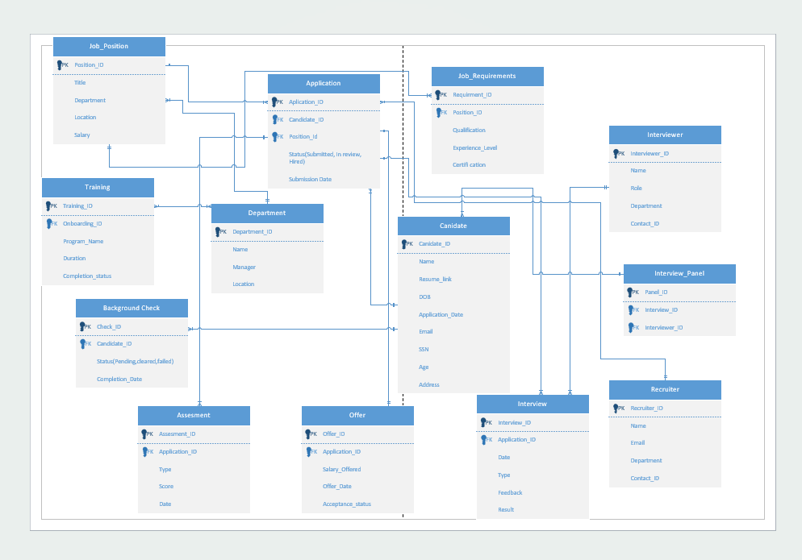

## Entity Relationship Diagram (ERD)

The diagram below illustrates the database entities, attributes, and relationships for the Delta Airlines Hiring Database.

The ERD for this project was created using Microsoft Visio to visually model the relational database structure before implementation.

Visio was used to:
- Identify core entities (Candidate, Application, Job_Position, Department, etc.)
- Define primary keys and foreign key relationships
- Establish one-to-many relationships between tables
- Ensure proper normalization (1NF, 2NF, 3NF)
- Validate relational integrity before writing SQL code

Designing the ERD in Visio allowed the team to clearly visualize data flow across the hiring process, from application submission through interviews, offers, background checks, and onboarding.

The finalized ERD served as the blueprint for implementing the database schema in Microsoft Access.
The ERD was iteratively refined to reduce redundancy and ensure referential integrity across all tables.

